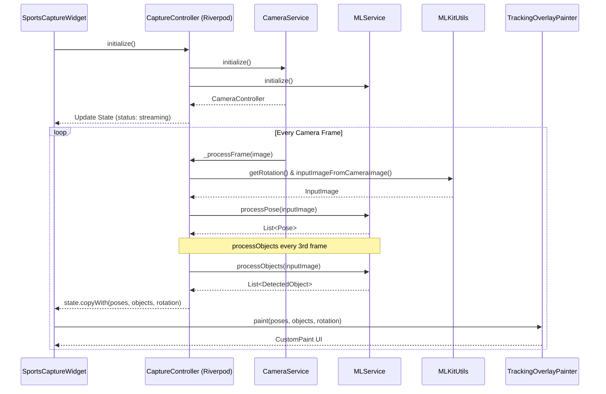
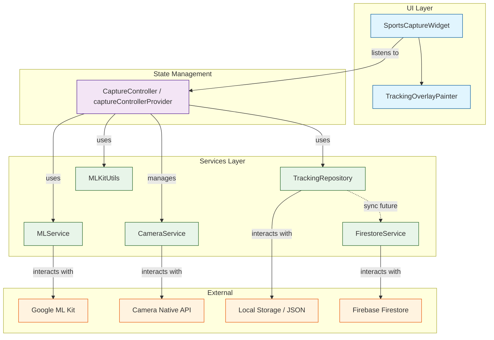

# System Architecture

This document describes the interaction between the core components of the PS AI Flutter application, focusing on the sports capture and tracking functionality.

## Sequence Diagram: Frame Processing

## Component Interaction Diagram

## Key Responsibilities

| Component | Responsibility |
|-----------|----------------|
| **SportsCaptureWidget** | Renders the camera preview and overlays. Handles user input (Start/Stop). |
| **CaptureController** | Orchestrates services. Manages processing lifecycle and state. Throttles ML processing. |
| **CameraService** | Wraps the `camera` package. Manages hardware lifecycle and image streaming. |
| **MLService** | Wraps `google_mlkit_pose_detection` and `google_mlkit_object_detection`. |
| **TrackingRepository** | Persists `TrackingSession` data to local files as JSON. |
| **TrackingOverlayPainter** | Translates ML coordinates to UI coordinates and draws shapes. |
| **MLKitUtils** | Handles conversion from `CameraImage` to `InputImage` and orientation math. |
